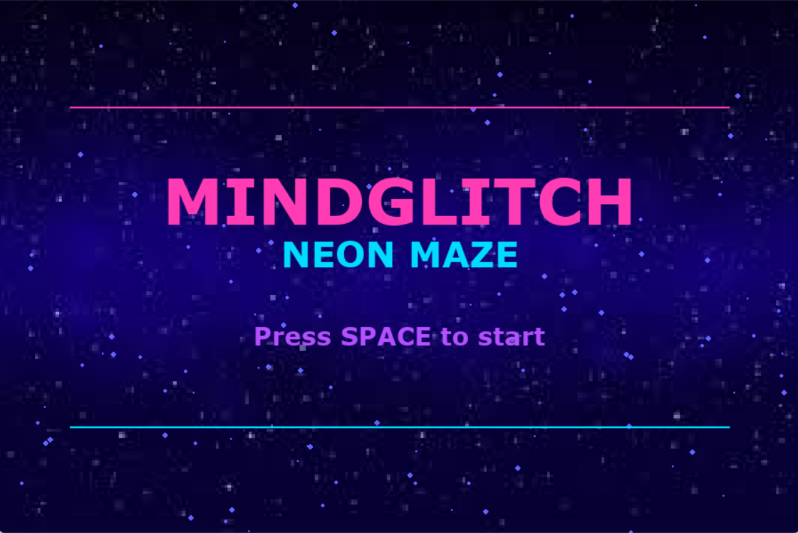
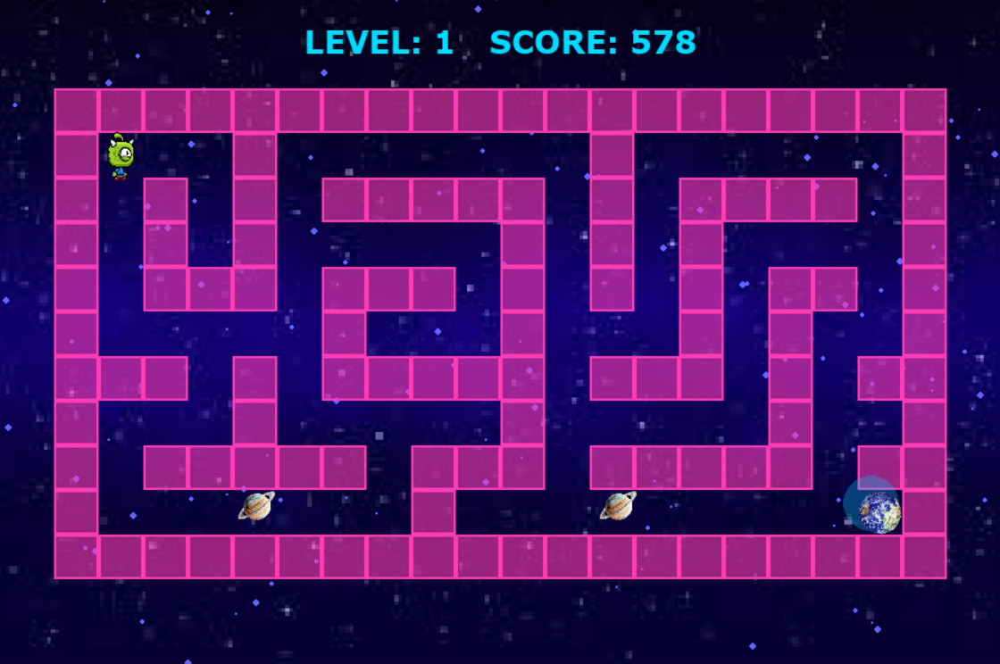
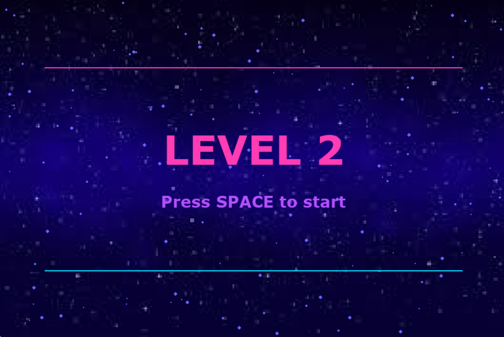
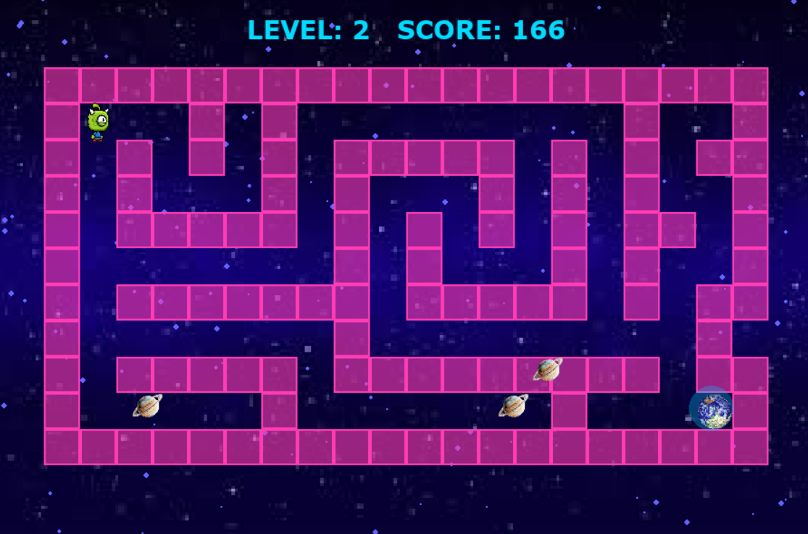
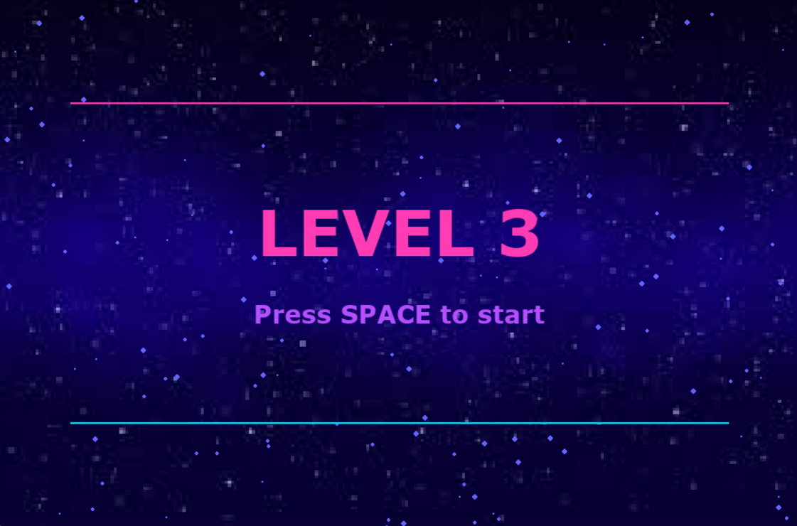
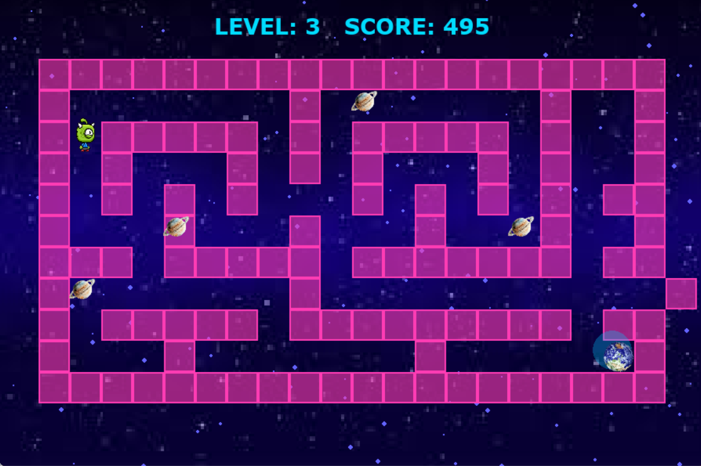
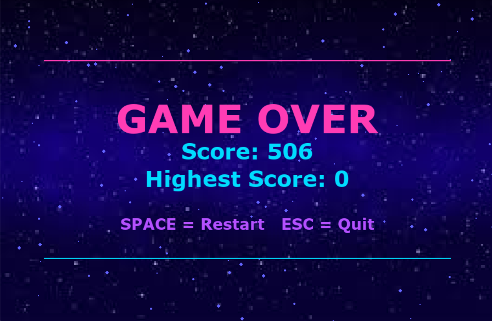
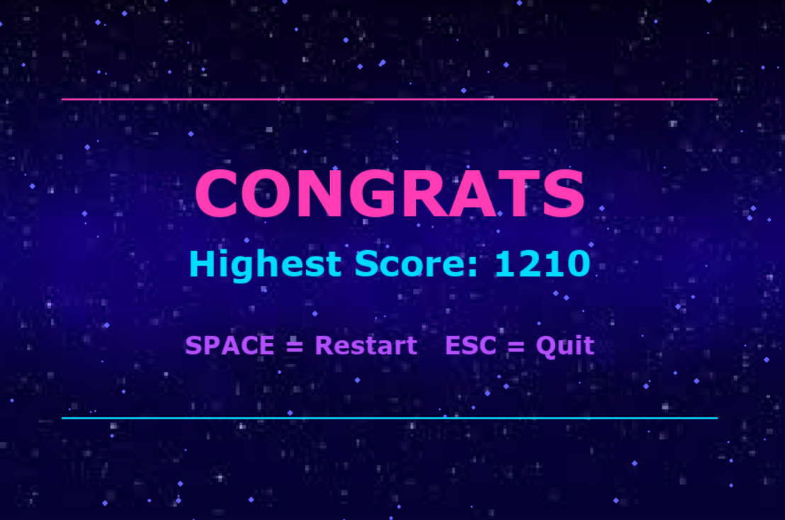

# 🎮 MindGlitch Maze

MindGlitch Maze is a space-themed maze game built using Python and Pygame. Navigate through neon-style levels, avoid moving obstacles, and reach the goal.

---

## 🚀 Features

* 3 progressive levels
* Animated space background
* Moving obstacles
* Score tracking

---

## 🕹️ Controls

* Arrow Keys → Move
* SPACE → Start / Restart
* ESC → Quit

---

## 📸 Screenshots

  
  

  
  

  
  

  
  

---

## 🛠️ Tech Stack

* Python
* Pygame

---
## ▶️ Run the Game

pip install pygame  
python MindGlitch_Maze_Final.py

---

## 👤 Author

Suhani Jadhav
